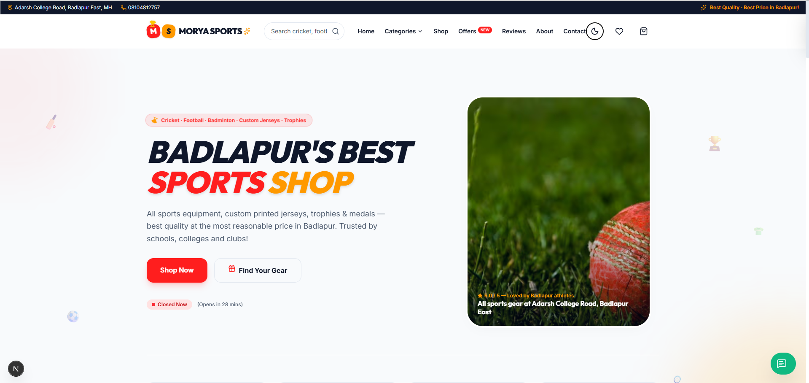
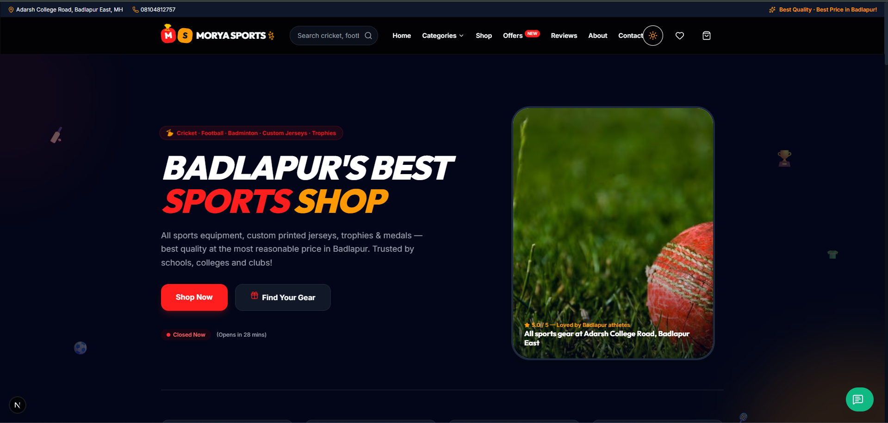

# Morya Sports Badlapur 🏆

**Badlapur's Premier Online Sports Equipment & Sportswear Store** — A fully-featured Next.js 16 e-commerce website built for Morya Sports Badlapur ®️, Bebika Palace, Adarsh College Road, Badlapur East, Maharashtra.

---

## 📸 Screenshots

| Light Mode | Dark Mode |
| :---: | :---: |
|  |  |

---

## ✨ Features

### 🛒 Shopping Experience
- Product catalog with sports categories (Cricket, Football, Badminton, Gym, Trophies, Custom Jerseys, and more)
- Quick View modal with product specifications
- Custom order options with name printing or custom tag selection
- Persistent Cart & Wishlist state using Zustand
- WhatsApp Product Enquiry button on all detail views

### 💳 Checkout & Payments
- 3-step checkout (Address → Shipping → Payment)
- **Simulated Razorpay** payment gateway with UPI QR Code scan
- Cash on Delivery (COD) option
- Coupon code discount system (`SPORTS10`, `TEAM20`)
- Local home delivery + store pickup options
- **Printable GST Invoice** with automatic SGST/CGST calculations

### 📦 Order Tracking
- Real-time order tracking status page at `/track-order`
- Live interactive status progression timeline
- Dynamic WhatsApp integration for ordering and verification

### 🏪 Admin Panel Dashboard
- Store management dashboard at `/admin`
- Live inventory tracker with low stock alerts (≤5 units highlighted)
- Timings manager with holiday mode & closing hour override
- Local delivery configuration (radius, base fees, free thresholds, windows)
- Simulated orders status update console with one-click WhatsApp notification trigger

---

## 🛠️ Tech Stack

| Layer | Technology |
|---|---|
| Framework | Next.js 16 (App Router) |
| Language | TypeScript |
| Styling | Tailwind CSS v4 |
| State | Zustand (with `persist`) |
| Fonts | Google Fonts — Poppins + Inter |
| Icons | Lucide React |

---

## 🚀 Getting Started

```bash
# 1. Install dependencies
npm install

# 2. Run dev server
npm run dev
```

Open [http://localhost:3000](http://localhost:3000)

---

## 🏪 Store Information

**Morya Sports Badlapur ®️**  
Shop No 15, Bebika Palace, Adarsh College Road, Badlapur East, Maharashtra 421503  
📞 08104812757  
📧 moryasportsbadlapur@gmail.com  

---

## 👨‍💻 Developed By

This website was designed, engineered, and deployed by:

* **Datta Sable** — *Full-Stack Developer & Solutions Architect*  
  🌐 [Portfolio Website](https://dattasable.com) | 🐙 [GitHub Profile](https://github.com/sabledattatray)

---

## 📄 License

This project is a custom-built commercial website for **Morya Sports Badlapur ®️**.  
© 2026 Morya Sports. All rights reserved.

